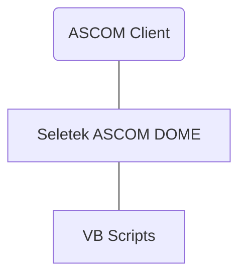
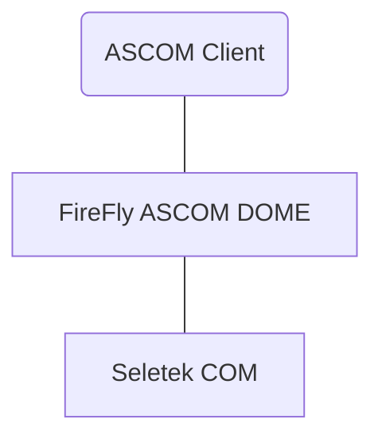

# WORK IN PROGRESS
# Firefly Dome Driver

ASCOM Driver for Lunatico Seletek Firefly

Advantages to VBS Scripts
* Can be used by mulitple programs simultaneously
* Can recover from unknown roof state
* VBS (VBScript) was declared deprecated by Microsoft and will be removed from future Windows releases
* Control UI

## Architecture
### Using VBS

### Using Seletek Firefly ASCOM Driver

	