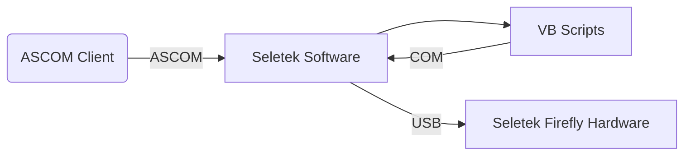

# WORK IN PROGRESS
# Seletek Firefly ROR Driver

ASCOM Dome Driver for Lunatico Seletek Firefly for Roll-off-Roofs

**Advantages to VBS Scripts**
* Can be used by mulitple programs simultaneously
* Can recover from unknown roof state
* Timeout by time instead of number of retries
* Control UI
* VBS (VBScript) was declared deprecated by Microsoft and will be removed from future Windows releases
  https://learn.microsoft.com/en-us/windows/whats-new/deprecated-features

## Requirements
* Garage door type opener for Roll-off-Roof with 2 limit switches
* Seletek Firefly Hardware and Software
* ASCOM Platform 6.5 or later

## Architecture
### Using VBS

### Using Seletek Firefly ROR ASCOM Driver

	