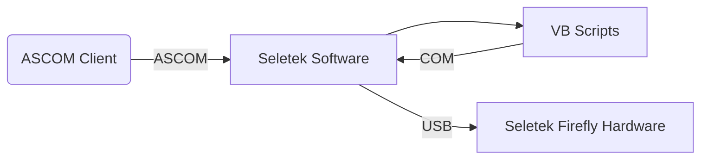

# WORK IN PROGRESS
# Seletek Firefly ROR Driver

ASCOM Dome Driver for Lunatico Seletek Firefly for Roll-off-Roofs

**Advantages**
* Can be used by mulitple programs simultaneously
* Can recover from unknown roof state
* Timeout by time instead of number of retries
* VBS (VBScript) was declared deprecated by Microsoft and will be removed from future Windows releases
  https://learn.microsoft.com/en-us/windows/whats-new/deprecated-features
* Control UI
* 

## Requirements
* Garage door type opener for Roll-off-Roof with 2 limit switches
* Seletek Firefly Hardware and Software
* ASCOM Platform 6.5 or later
* Windows 7 or later
  
---
## Configuration

* Roof Open Sensor - Sensor ID from Seletek which is true when the roof is open
* Roof Closed Sensor - SensoID from Seletek which is true when the roof is closed
* Roof Relay Number - Relay ID from Seletek which will start/stop a motion of the roof
* No motion timeout - Timeout in seconds after a sensor must become false when a open/close command was triggerd
* Total timeout - Timout in seconds when a open/close command fails
* Relay pause - Delay between two relay pushes
* Sensor polling - Frequency of sensor polling
  
---
## Architecture
### Using VBS

### Using Seletek Firefly ROR ASCOM Driver

	

## Credits

Icon made by [max.icons](https://www.flaticon.com/de/autoren/maxicons) from [www.flaticon.com](https://www.flaticon.com/)
